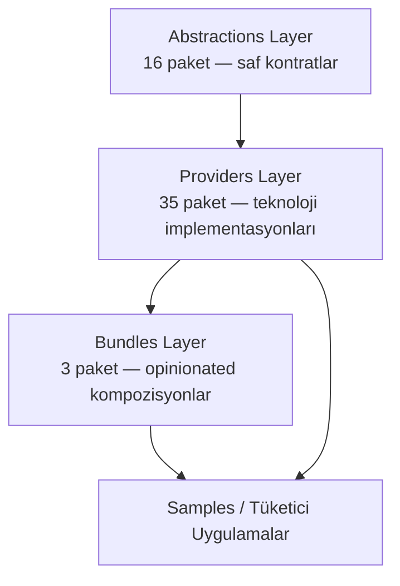
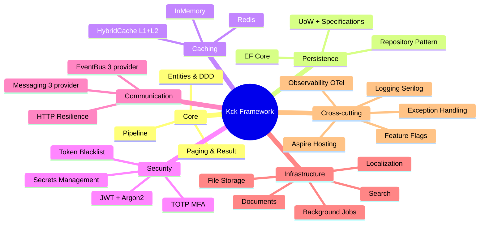
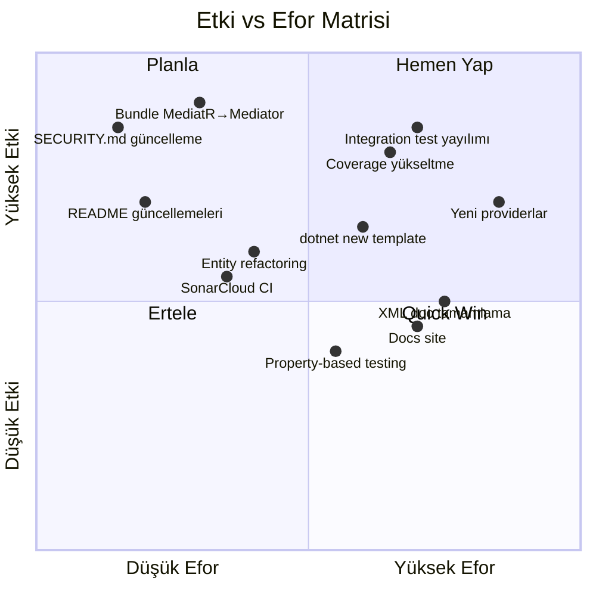

# OmerkckArchitecture — Detaylı Analiz & Geliştirme/Sürdürülebilirlik Planı

## 1. Proje Özeti

**Kck Modular Architecture Framework** — .NET 10 tabanlı, modüler, genişletilebilir bir framework. **Abstractions → Providers → Bundles** üç katmanlı deseniyle organize edilmiş, MIT lisanslı açık kaynak proje.

### Sayısal Genel Bakış

| Metrik | Değer |
|---|---|
| Abstractions | **16** paket |
| Providers | **35** paket |
| Bundles | **3** (WebApi, MinimalApi, WorkerService) |
| Test Projeleri | **37** (unit + integration + benchmark) |
| ADR Sayısı | **21** kayıt |
| Sample Projeler | **3** |
| CI/CD Workflow | **6** (build-test, codeql, dependabot-lockfile, license-audit, nuget-publish, release-drafter) |
| Docs | **18** provider guide + 4 policy + test strategy + migration guide |
| NuGet Bağımlılık | Central Package Management ile **~55** paket |
| Hedef Framework | `net10.0` (tek TFM) |

---

## 2. Mimari Analiz

### 2.1 Katmanlı Yapı (Güçlü ✅)



**Güçlü yönler:**
- Abstractions tamamen provider-free — hiçbir SDK bağımlılığı yok
- `IsAotCompatible=true` tüm 16 abstraction'da aktif
- `PublicApiAnalyzers` ile 875 public symbol otomatik izleniyor
- Kontratlar `interface` bazlı, DI-first tasarım

### 2.2 Kapsam Alanları



---

## 3. Güçlü Yönler

### ✅ Olgunluk İşaretleri

| Alan | Detay |
|---|---|
| **ADR Disiplini** | 21 ADR — her mimari karar belgelenmiş, superseded karar var |
| **SemVer + PublicApiAnalyzers** | Public API değişiklikleri otomatik izleniyor, breaking change RS0016 ile build hatası |
| **Central Package Management** | `Directory.Packages.props` ile tüm bağımlılık versiyonları tek noktadan yönetiliyor |
| **Deterministic Build + Source Link** | `.snupkg` symbol paketleri, kaynak kodu referansı debug'ta mevcut |
| **CI/CD Olgunluğu** | Build-test (ubuntu+windows), coverage gate, CVE audit, license audit, CodeQL, release-drafter |
| **Deprecation Policy** | `KCK0001-0999` DiagnosticId ile formal obsoletion lifecycle |
| **Security Policy** | CVSS bazlı yanıt SLA'ları, coordinated disclosure, 90 gün embargo |
| **Conventional Commits** | Commit mesajı standardı, type scope formatı |
| **Lock File** | `RestorePackagesWithLockFile=true` — reproducible build |
| **TreatWarningsAsErrors** | Tüm projeler 0-warning zorunluluğu |

### ✅ Kod Kalitesi

- `Result<T>` pattern saf ve fonksiyonel (`Map`, `Bind`, `Tap`, `Ensure`)
- `Entity<TId>` base class: `IAuditable`, `ISoftDeletable`, `IDomainEvent`, `RowVersion` hepsi yerleşik
- `QueryOptions` readonly record struct — bool parameter antipattern'i çözülmüş
- `Paginate<T>` immutable (`{ get; init; }`) — thread-safe
- `DebuggerDisplay` attribute'ları kritik tiplerde var
- `CacheServiceBase` 64-şeritli lock dizisi — bellek sızıntısı çözülmüş

---

## 4. Zayıf Yönler & Teknik Borç

### 🔴 Kritik

| # | Sorun | Etki | Konum |
|---|---|---|---|
| **C1** | **Test coverage %40 line / %35 branch** — endüstri standardı kütüphane için çok düşük (%75+ olmalı) | Regresyon riski yüksek, refactoring güvensiz | Tüm test projeleri |
| **C2** | **SECURITY.md "0.x" diyor ama proje v2.0** — supported versions tablosu güncel değil | Kullanıcılar hangi sürümün desteklendiğini bilemez | [SECURITY.md](file:///c:/Users/admin/Desktop/CVsCode/OmerkckArchitecture/SECURITY.md) |
| **C3** | **Bundle.WebApi hala MediatR referansı var** ama MediatR deprecated (KCK0200) | Tüketiciler deprecated bundle kullanıyor | [Kck.Bundle.WebApi.csproj](file:///c:/Users/admin/Desktop/CVsCode/OmerkckArchitecture/src/Bundles/Kck.Bundle.WebApi/Kck.Bundle.WebApi.csproj#L23) |
| **C4** | **Integration test sadece PostgreSQL PoC** — Redis, RabbitMQ, Elasticsearch testleri mock | Gerçek ortam davranışları test edilmiyor | `docs/test-strategy.md` satır 76-83 |

### 🟡 Orta

| # | Sorun | Etki | Konum |
|---|---|---|---|
| **M1** | **Mutation testing (Stryker.NET) henüz yok** — "Trial mode" olarak işaretli | Test kalitesi ölçülemiyor | `docs/test-strategy.md` satır 105-108 |
| **M2** | **Property-based testing henüz yok** — FsCheck/CsCheck planlanmış | Edge case coverage eksik | `docs/test-strategy.md` satır 110-113 |
| **M3** | **Benchmark CI regression yok** — sonuçlar deterministik değil denmiş ama bencher.dev gibi çözümler var | Performans regresyonları fark edilmiyor | `docs/test-strategy.md` satır 101-103 |
| **M4** | **XML Documentation eksik** — `NoWarn: 1591` ile suppressed | Intellisense kalitesi düşük, NuGet paketi dokümansız | [Directory.Build.props](file:///c:/Users/admin/Desktop/CVsCode/OmerkckArchitecture/Directory.Build.props#L10) |
| **M5** | **`Kck.Resilience.Polly` README'de eksik** — provider listesinde yok | Kullanıcılar provider'ı bulamaz | [README.md](file:///c:/Users/admin/Desktop/CVsCode/OmerkckArchitecture/README.md) |
| **M6** | **`Kck.Caching.Hybrid` README'de eksik** — provider listesinde yok | Yeni eklenen feature keşfedilemez | [README.md](file:///c:/Users/admin/Desktop/CVsCode/OmerkckArchitecture/README.md) |
| **M7** | **`Kck.Hosting.Aspire` README'de eksik** — Aspire integration keşfedilemez | Yeni eklenen feature keşfedilemez | [README.md](file:///c:/Users/admin/Desktop/CVsCode/OmerkckArchitecture/README.md) |
| **M8** | **`PublicAPI.Unshipped.txt` dosyaları dolu** — release yapılmamış API'lar birikmiş | Ship/Unship tutarsızlığı | `Kck.Core.Abstractions`, `Kck.Persistence.Abstractions` |

### 🟢 Düşük / İyileştirme

| # | Sorun | Etki | Konum |
|---|---|---|---|
| **L1** | `Entity<TId>.CreatedDate = DateTime.UtcNow` constructor'da atanıyor — EF Core migration'ında sorun olabilir | Audit field tutarsızlığı | [Entity.cs](file:///c:/Users/admin/Desktop/CVsCode/OmerkckArchitecture/src/Abstractions/Kck.Core.Abstractions/Entities/Entity.cs#L17) |
| **L2** | `Entity<TId>` id setter `public` — DDD'de id dışarıdan değiştirilmemeli | Encapsulation ihlali | [Entity.cs](file:///c:/Users/admin/Desktop/CVsCode/OmerkckArchitecture/src/Abstractions/Kck.Core.Abstractions/Entities/Entity.cs#L13) |
| **L3** | SonarCloud entegrasyonu properties var ama CI workflow'da sonar scanner step yok | Statik analiz eksik | [.sonarcloud.properties](file:///c:/Users/admin/Desktop/CVsCode/OmerkckArchitecture/.sonarcloud.properties) |
| **L4** | `Kck.Pipeline.Mediator` behaviors → SonarCloud CPD exclusion yapılmış ama gerçek DRY uygulanmamış | Behavior'lar arasında yapısal tekrar | `.sonarcloud.properties` |
| **L5** | Dependabot lockfile workflow var ama `CODEOWNERS` sadece 1 kişi | Bus factor = 1 | [CODEOWNERS](file:///c:/Users/admin/Desktop/CVsCode/OmerkckArchitecture/CODEOWNERS) |
| **L6** | `OpenTelemetry.Instrumentation.EntityFrameworkCore` **beta** paketi kullanılıyor | Üretim kararsızlığı | [Directory.Packages.props](file:///c:/Users/admin/Desktop/CVsCode/OmerkckArchitecture/Directory.Packages.props#L98) |
| **L7** | `Kck.FeatureFlags.InMemory` tek provider — production-grade feature flag (LaunchDarkly, Azure App Config) yok | Sınırlı feature flag desteği | Provider listesi |
| **L8** | `Kck.FileStorage.FluentFtp` tek provider — Azure Blob / AWS S3 yok | Sınırlı dosya depolama | Provider listesi |

---

## 5. Bağımlılık Sağlık Durumu

### Dikkat Edilmesi Gerekenler

| Paket | Sürüm | Durum | Risk |
|---|---|---|---|
| `Newtonsoft.Json` | 13.0.4 | Hangfire transitive override (GHSA-5crp-9r3c-p9vr) | ⚠️ Hangfire 2.x ile kalkacak |
| `OpenTelemetry.*.EntityFrameworkCore` | 1.12.0-beta.2 | **Pre-release** | ⚠️ Kararlı sürüm bekle |
| `Mediator.Abstractions` | 3.0.2 | Kararlı (3.1.0-prerelease'den düşürüldü) | ✅ |
| `Hangfire` | 1.8.23 | Aktif bakım | ✅ |
| `MailKit` | 4.16.0 | CVE fixli | ✅ |

---

## 6. Geliştirme & Sürdürülebilirlik Yol Haritası

> [!IMPORTANT]
> Aşağıdaki plan **5 faz** halinde organize edilmiştir. Her faz bağımsız olarak tamamlanabilir. Öncelik sırası: Kritik sorunlar → Test kalitesi → DX (Developer Experience) → Yeni özellikler → Ekosistem genişleme.

---

### FAZ-A: Kritik Düzeltmeler & Tutarsızlık Giderme *(~1 hafta)*

> [!CAUTION]
> Bu fazdaki öğeler hemen ele alınmalıdır — mevcut kullanıcıları doğrudan etkilemektedir.

#### A1. SECURITY.md Güncelleme
- Supported versions tablosunu `v2.x` (current) + `v1.x` (security-only) olarak güncelle
- `0.x` referanslarını kaldır

#### A2. Bundle.WebApi MediatR → Mediator Geçişi
- `Kck.Bundle.WebApi.csproj`'dan `Kck.Pipeline.MediatR` referansını `Kck.Pipeline.Mediator` ile değiştir
- `ServiceCollectionExtensions.cs`'de pipeline registration'ı güncelle
- Migration kılavuzu bağlantısını bundle docs'a ekle

#### A3. README Güncellemeleri
- Provider tablosuna ekle: `Kck.Resilience.Polly`, `Kck.Caching.Hybrid`, `Kck.Hosting.Aspire`, `Kck.Pipeline.Mediator`
- MediatR pipeline'ı deprecated olarak işaretle
- Bundles tablosuna `Kck.Bundle.MinimalApi` ve `Kck.Bundle.WorkerService` ekle

#### A4. PublicAPI.Unshipped → Shipped Taşıma
- v2.0 release'ine ait Unshipped API'ları `PublicAPI.Shipped.txt`'a taşı
- `PublicAPI.Unshipped.txt`'ları temizle (v3 döngüsüne hazırlık)

---

### FAZ-B: Test Kalitesi Yükseltme *(~3-4 hafta)*

#### B1. Integration Test Yayılımı (LS-FAZ-4.5 tamamlama)
| Test Projesi | Container | Hedef |
|---|---|---|
| `Kck.Caching.Redis.Tests` | `redis:7-alpine` | Testcontainers ile gerçek Redis |
| `Kck.EventBus.RabbitMq.Tests` | `rabbitmq:3-management-alpine` | Gerçek broker connection |
| `Kck.Search.Elasticsearch.Tests` | `elasticsearch:8.x` | Gerçek index CRUD |

#### B2. Coverage Gate Yükseltme
- **Kademe 1 hedefi:** Line %50, Branch %45
- Eksik test alanları (provider DI registration, error handling paths, edge cases)
- Her provider için en az 5 yeni unit test

#### B3. Property-Based Testing Başlatma
- `CsCheck` veya `FsCheck` bağımlılığı ekle
- Hedef tipler: `Paginate.Create` math doğruluğu, `Filter.GetValue<T>` type safety, `PathSanitizer` traversal rejection
- Test sınıfı: `Kck.Core.Abstractions.Tests/Properties/`

#### B4. Mutation Testing PoC
- `Stryker.NET` tool olarak ekle
- Sadece `Kck.Core.Abstractions` + `Kck.Persistence.Abstractions` üzerinde başla
- Hedef mutation score: >%70

---

### FAZ-C: Developer Experience (DX) & Dokümantasyon *(~2-3 hafta)*

#### C1. XML Documentation Tamamlama
- `NoWarn: 1591` suppression'ını kaldır
- Tüm `public` ve `protected` üyelere XML doc ekle
- Öncelik: Abstractions (16 paket) → Bundle DI extension'ları → Provider public API

#### C2. SonarCloud CI Entegrasyonu
- `build-test.yml`'a SonarCloud scanner step ekle
- Quality gate: coverage + code smells + duplications
- PR decoration aktifleştir

#### C3. Benchmark CI Regression
- `bencher.dev` veya GitHub Actions benchmark action ekle
- `Kck.Benchmarks` sonuçlarını CI'da izle
- %10'dan fazla regression → build failure

#### C4. README İngilizce/Türkçe Tutarlılığı
- README'nin bir dili ana olarak seç (Türkçe veya İngilizce)
- ADR'ler Türkçe — README karışık → tutarlı hale getir
- İkinci dil için `README.tr.md` veya `README.en.md` ayrı dosya oluştur

#### C5. Docs Site (Opsiyonel)
- DocFX veya VitePress ile statik docs site oluştur
- Provider guide'lar, ADR'ler, migration kılavuzları tek noktadan erişilebilir olsun
- GitHub Pages ile otomatik deploy

---

### FAZ-D: Mimari İyileştirmeler *(~2-3 hafta)*

#### D1. Entity Base Class Refactoring

```diff
- public virtual TId Id { get => _id; set => _id = value; }
+ public virtual TId Id { get => _id; protected set => _id = value; }

- public virtual DateTime CreatedDate { get; set; } = DateTime.UtcNow;
+ public virtual DateTime CreatedDate { get; set; }
```

> [!WARNING]
> Bu bir **breaking change** olacaktır. ADR-0022 yazılmalı ve v3.0 major release'de planlanmalıdır.

#### D2. Bundle Configürasyon Validasyonu
- Bundle `AddKckWebApiDefaults` içinde config validation ekle
- Options pattern ile `IValidateOptions<T>` implementasyonu
- Hatalı config → startup'ta açık hata mesajı (fail-fast)

#### D3. Resilience Pattern Standardizasyonu
- `Kck.Resilience.Polly` ve `Kck.Http.Resilience` arasındaki ilişkiyi netleştir
- Circuit breaker + retry + timeout pattern'ını tüm provider'larda standartlaştır

#### D4. AOT Uyumluluk Genişletme
- Provider'larda `[RequiresUnreferencedCode]` / `[DynamicallyAccessedMembers]` attribute audit
- AOT test projesi ekle (PublishAot=true ile smoke test)
- Hedef: abstraction'lar %100 AOT-safe, kritik provider'lar uyumlu

---

### FAZ-E: Ekosistem Genişleme *(~4-6 hafta)*

#### E1. Yeni Provider'lar

| Paket | Açıklama | Öncelik |
|---|---|---|
| `Kck.FileStorage.AzureBlob` | Azure Blob Storage provider | Yüksek |
| `Kck.FileStorage.AwsS3` | AWS S3 provider | Yüksek |
| `Kck.FeatureFlags.AzureAppConfig` | Azure App Configuration feature flags | Orta |
| `Kck.Persistence.Dapper` | Lightweight ORM alternatifi | Orta |
| `Kck.Messaging.Twilio` | SMS provider | Düşük |
| `Kck.Caching.Garnet` | Microsoft Garnet cache provider | Düşük |

#### E2. dotnet new Template
- `dotnet new kck-webapi` template paketi oluştur
- Scaffold: Program.cs + appsettings + Docker Compose + health check + sample controller
- NuGet'e `Kck.Templates` olarak yayınla

#### E3. Aspire Dashboard Entegrasyonu
- `Kck.Hosting.Aspire` genişlet: service discovery, distributed tracing dashboard
- Sample projeye Aspire AppHost ekle

#### E4. NuGet Package README
- Her NuGet paketine inline README.md ekle (`<PackageReadmeFile>`)
- nuget.org'da paket sayfasında doğrudan dokümantasyon görünsün

---

## 7. Sürdürülebilirlik Kontrol Listesi

> [!TIP]
> Uzun vadeli sürdürülebilirlik için periyodik olarak kontrol edilecek alanlar.

| Alan | Aksiyon | Periyot |
|---|---|---|
| **Bağımlılık güncellemeleri** | Dependabot PR'larını merge et, CVE audit kontrol et | Haftalık |
| **Coverage gate** | Kademe yükseltme yol haritasına bağlı kal | Her faz sonunda |
| **ADR güncelliği** | Superseded ADR'leri işaretle, yeni mimari kararlarda ADR yaz | Her major karar |
| **PublicAPI tracking** | Unshipped → Shipped taşımasını her release'de yap | Her release |
| **TFM desteği** | .NET 12 çıkınca net12 hedef değerlendirmesi yap | .NET 12 preview |
| **.NET EOS** | .NET 10 STS EOS: 2027-05-10 — net12 LTS'e geçiş planla | 2027 Q1 |
| **Bus factor** | CODEOWNERS'a ek maintainer ekle, contributing rehberini genişlet | 2026 Q3 |
| **License audit** | `license-audit.yml` sonuçlarını haftalık kontrol et | Haftalık (otomatik) |
| **Release notes** | `release-drafter` çıktısını gözden geçir | Her release |
| **Benchmark baseline** | Performans regression'ları izle | Her major release |

---

## 8. Öncelik Matrisi



---

## 9. Doğrulama Planı

### Her Faz İçin

1. `dotnet build -c Release` — 0 hata, 0 uyarı (KCK0200 hariç)
2. `dotnet test --filter "Category!=Integration"` — tüm unit testler geçmeli
3. `dotnet test --filter "Category=Integration"` — tüm integration testler geçmeli (Docker gerekli)
4. Coverage gate threshold kontrolü
5. `PublicApiAnalyzers` — RS0016/RS0017 hatası olmamalı

### Release Öncesi

1. CHANGELOG.md `[Unreleased]` bölümü dolu olmalı
2. PublicAPI.Unshipped → Shipped taşınmalı
3. Tüm ADR'ler güncel olmalı
4. Sample projeler çalışır durumda olmalı

---

## Open Questions

> [!IMPORTANT]
> Aşağıdaki sorular uygulamaya geçmeden önce netleştirilmelidir:

1. **Dil tercihi:** README, docs ve code comments için tek bir dil standardı mı belirlenmeli (Türkçe vs İngilizce)? Yoksa mevcut karışık yapı korunacak mı?

2. **FAZ sıralaması:** Yukarıdaki 5 fazdan hangisi(leri) ile başlamak istiyorsunuz? Hepsini sırayla mı, yoksa belirli fazlara öncelik mi verilsin?

3. **Breaking changes (FAZ-D):** Entity base class refactoring gibi breaking change'ler v3.0'a mı planlanmalı, yoksa minor release'de deprecation cycle ile mi gidilmeli?

4. **Yeni provider'lar (FAZ-E):** Öncelik sırası doğru mu? Farklı provider ihtiyaçları var mı?

5. **Bus factor:** Projeye ek maintainer/contributor ekleme planı var mı?
